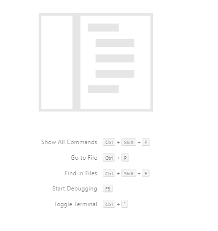

# The Code-Server environment

Code-Server provides a VSCode-like Environment for software development in remote server.

The welcome screen is shown when the app is launched.


Close the Welcome tab to view the basic commands in VSCode.



Press Ctrl+shift+P to input commands. Type "theme". Select the Dark+ color theme. 


You may execute Linux commands in the `TERMINAL` tab.


Try: 

* Start a new terminal
* Remove a terminal
* Split terminal

To show the menu bar on top:


## Allowing the VSCode to read/write from the clipboard

In chrome browser, type in the URL input box `chrome://settings/content/clipboard`

Click **Add a site**- and input `[*.]vl.polyu.edu.hk` .


To clear the terminal, input 

```text
clear
```

You can also use the shortcut Ctrl+L to clear the terminal


Try to perform the following tasks

* Creating terminal
* Remove terminal
* Split terminal


## \*\*\* The End \*\*\*

